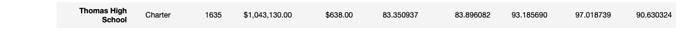

# School District Analysis

## Overview of the Analysis

- This analysis examines the Math and Reading test scores as they relate to individual schools, school types, school sizes, overall school budgets, and spending per student.
- After performing the initial analysis, the school board discovered academic dishonesty among the Thomas High School 9th grade requiring a new analysis factoring in this new information. 
- Therefore, all Thomas High School 9th grade Math and Reading scores were replaced with NaN and the school district analysis has been repeated. 

## Results

- Replacing the Thomas High School 9th grade test scores with NaN requires recalculating student test score totals and average math and reading scores to complete the School District Analysis with accuracy and integrity. 

- Afer replacing these values, Thomas High School is still ranked the number 2 top school.
    - This is largely due to removing the number of 9th grade students when calculating the averages and passing percentages (Math, Reading, and Overall).

### District Summary Results

- Comparing the original district to the summary to the new district summary reveals some slight changes:
    - The Average Math score dropped .1 point
    - The % Passing Math dropped .2 point
    - The % Passing Reading dropped .3 point
    - The % Overall Passing dropped .1 point.

- Image of the Original District Summary:

- Image of the New District Summary:

### School Summary Results

- Examining the orignal school summary to the new school summary reveals the following differences for Thomas High School:
    - Average Math score drops from 83.42 to 83.35
    - Average Reading score drops from 83.84 to 83.90
    - % Passing Math drops from 93.27 to 93.19
    - % Passing Reading drops from 97.31 to 97.02
    - % Overall Passing drops from 90.95 to 90.63

- Image of the Original School Summary

- Image of the New School Summary

### Math and Reading Scores by Grade

#### Math Scores
- This comparison reveals the largest differences:
    - The Math scores in the original analysis shows Thomas High School 9th Grade to have an average Math score of 83.6
    - New analysis shows Thomas High School 9th grade to have NaN

- Image of Original Math Score by Grade Analysis:

- Image of New Math Score by Grade Analysis:

#### Reading Scores

- Like the Math score comparison, this analysis reveals the largest differences:
    - The Reading score in the original analysis shows Thomas High School 9th Grade to have an average Reading score of 83.7
    - The Reading score in the new analysis for Thomas High School 9th grade is NaN

- Image of Original Reading Score by Grade Analysis:

- Image of New Reading Score by Grade Analysis:

### Scores by School Spending

- The schools are organized into 4 spending/student bins:
    1. < $586
    2. $586-630
    3. $631-645
    4. $646-675

- Thomas High School falls within the $631-645 range:
    - Comparing the 2 analyses reveals no differences when the average math and reading scores are rounded to the nearest tenth and the Percent Passing Math and Reading and Percent Overall Passing are rounded to nearest whole numbers

- Image of the Original School Spending Analysis:

- Image of the New School Spending Analysis

### Scores by School Size

- The schools are organized into 3 school size bins:
    1. Small (< 1000)
    2. Medium (1000-1999)
    3. Large (1999-5000)

- Thomas High School is within the Medium bin:
    - Comparing the school size analyses reveals no differences in the medium bin when the average Reading and Math scores are rounded to the nearest tenth and the passing Math and Reading percentages and Overall passing psercentages are rounded to the nearest whole number

    - Expanding the comparison to the hundredths reveals the amounts dropping by the following amounts in the new analysis:
        - Avg Math Scores: difference of .01
        - Avg Reading Scores: difference of .01
        - Percent Passing Math: difference of .02
        - Percent Passing Reading: difference of .06
        - Percent Overall Passing: difference of .06

- Image of the Original School Size Analysis

- Image of the New School Size Analysis

### Scores by School Type

- The schools were fell into 2 type categories: 
    1. Charter
    2. Disctrict

- Thomas High School is a Charter School:
    - Comparing the original and new analyses revealed no differences when the average Math and Reading scores are rounded to the nearest tenth and the passing Math and Reading percentages and Pverall passing percentages are rounded to the nearest whole number

    - Expanding the comparison to the hundredths reveals the amounts dropping by the following amounts in the new analysis:
        - Percent Passing Math: difference of .01
        - Percent Passing Reading: difference of .04
        - Percent Overall Passing: difference of .04

- Image of the Original School Type Analysis:

- Image of the New School Type Analysis:

## Summary

- Generally, the new analysis considering the Thomas High School academic dishonesty revealed some slight changes in the overall District Analysis. 

- Here are the top 4 differences that should be taken into account:
    1. Math and Reading Scores by grade analysis reveals that the Thomas High School 9th grade does not have data present for the Math and Reading Scores.
    2. The School Summary analysis does reveal some slight changes, but they are less striking because the averages and percentages are calculated by the total number of 10th-12th graders at Thomas High School.
    3. There are some slight differences when comparing the scores by school size and school type if you compare the values to the hundredths. 
    4. The scores by school spending reveals the least amount of change.